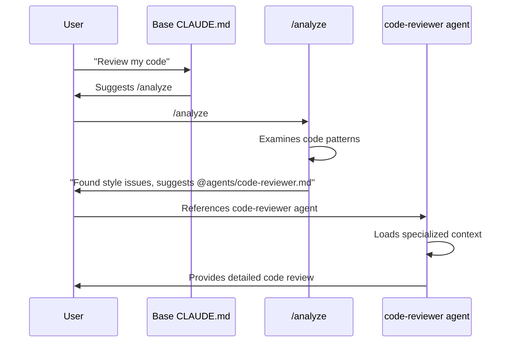
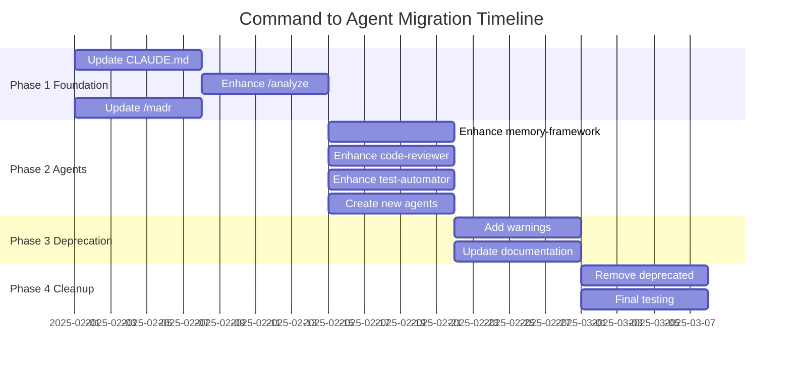

# Command and Agent Workflow Diagrams

## Overview: Command vs Agent Decision Flow

```mermaid
flowchart TD
    Start([User needs help]) --> Q1{Is it a unique<br/>cross-cutting task?}
    
    Q1 -->|Yes| Q2{What type?}
    Q1 -->|No| Q3{Do you know<br/>which agent?}
    
    Q2 -->|Architecture Decision| CMD1[/madr]
    Q2 -->|General Analysis| CMD2[/analyze]
    
    Q3 -->|Yes| Agent[Reference specific agent<br/>@agents/agent-name.md]
    Q3 -->|No| CMD2
    
    CMD2 --> Suggest[Analyze suggests<br/>appropriate agent]
    Suggest --> Agent
    
    style CMD1 fill:#e1f5fe
    style CMD2 fill:#e1f5fe
    style Agent fill:#f3e5f5
```

## Current State: 12 Commands

```mermaid
graph LR
    subgraph "Current Command Overload"
        U[User] --> C1[/analyze]
        U --> C2[/commands]
        U --> C3[/debug]
        U --> C4[/documentation]
        U --> C5[/generate-command]
        U --> C6[/generate-pr]
        U --> C7[/improve]
        U --> C8[/init-project]
        U --> C9[/madr]
        U --> C10[/memory-framework]
        U --> C11[/review]
        U --> C12[/test]
    end
    
    style U fill:#ffcdd2
```

## Target State: Simplified Architecture

```mermaid
graph TB
    subgraph "Commands Layer"
        U[User] --> CMD1[/madr<br/>Architecture Decisions]
        U --> CMD2[/analyze<br/>General Analysis]
    end
    
    subgraph "Agent Layer"
        CMD2 -.suggests.-> A1[memory-framework<br/>agent]
        CMD2 -.suggests.-> A2[code-reviewer<br/>agent]
        CMD2 -.suggests.-> A3[test-automator<br/>agent]
        CMD2 -.suggests.-> A4[debugger<br/>agent]
        CMD2 -.suggests.-> A5[pr-generator<br/>agent]
        
        U --> A1
        U --> A2
        U --> A3
        U --> A4
        U --> A5
    end
    
    style CMD1 fill:#e1f5fe
    style CMD2 fill:#e1f5fe
    style A1 fill:#f3e5f5
    style A2 fill:#f3e5f5
    style A3 fill:#f3e5f5
    style A4 fill:#f3e5f5
    style A5 fill:#f3e5f5
```

## Migration Mapping

```mermaid
graph LR
    subgraph "From Commands"
        direction TB
        FC1[/commands<br/>/documentation<br/>/memory-framework]
        FC2[/review]
        FC3[/test]
        FC4[/generate-pr]
        FC5[/debug]
        FC6[/improve]
    end
    
    subgraph "To Agents"
        direction TB
        TA1[memory-framework agent<br/>- Command listing<br/>- Documentation browsing<br/>- Framework guidance]
        TA2[code-reviewer agent<br/>- Code quality checks<br/>- Best practices<br/>- Suggestions]
        TA3[test-automator agent<br/>- Test generation<br/>- TDD workflows<br/>- Coverage analysis]
        TA4[pr-generator agent<br/>- PR creation<br/>- Git workflows<br/>- Review prep]
        TA5[debugger agent<br/>- Error analysis<br/>- Stack trace reading<br/>- Fix suggestions]
        TA6[Specialized agents<br/>- performance-engineer<br/>- security-auditor<br/>- refactoring-assistant]
    end
    
    FC1 ==> TA1
    FC2 ==> TA2
    FC3 ==> TA3
    FC4 ==> TA4
    FC5 ==> TA5
    FC6 ==> TA6
    
    style FC1 fill:#ffcdd2
    style FC2 fill:#ffcdd2
    style FC3 fill:#ffcdd2
    style FC4 fill:#ffcdd2
    style FC5 fill:#ffcdd2
    style FC6 fill:#ffcdd2
    style TA1 fill:#c8e6c9
    style TA2 fill:#c8e6c9
    style TA3 fill:#c8e6c9
    style TA4 fill:#c8e6c9
    style TA5 fill:#c8e6c9
    style TA6 fill:#c8e6c9
```

## User Journey Example: Code Review



## Context Loading Efficiency

```mermaid
graph TD
    subgraph "Before: Monolithic Context"
        BC[Base CLAUDE.md<br/>15KB] --> LC[Loaded Context<br/>150KB+]
        
        LC --> T1[Task: Review]
        LC --> T2[Task: Testing]
        LC --> T3[Task: Debug]
    end
    
    subgraph "After: Targeted Context"
        AC[Base CLAUDE.md<br/>3KB] --> CMD[/analyze<br/>2KB]
        
        CMD --> A1[code-reviewer<br/>10KB]
        CMD --> A2[test-automator<br/>12KB]
        CMD --> A3[debugger<br/>8KB]
        
        A1 --> T4[Task: Review]
        A2 --> T5[Task: Testing]
        A3 --> T6[Task: Debug]
    end
    
    style BC fill:#ffcdd2
    style LC fill:#ffcdd2
    style AC fill:#c8e6c9
    style CMD fill:#e1f5fe
    style A1 fill:#f3e5f5
    style A2 fill:#f3e5f5
    style A3 fill:#f3e5f5
```

## Discovery Mechanism Flow

```mermaid
flowchart TD
    Start([User needs help]) --> Check{Know what<br/>you need?}
    
    Check -->|No| Analyze[/analyze<br/>Examines context and code]
    Check -->|Yes| Type{What type?}
    
    Type -->|Architecture| MADR[/madr]
    Type -->|Code Quality| CR[@agents/code-reviewer.md]
    Type -->|Testing| TA[@agents/test-automator.md]
    Type -->|Performance| PE[@agents/performance-engineer.md]
    Type -->|Debugging| DB[@agents/debugger.md]
    
    Analyze --> Detect[Detects patterns<br/>and issues]
    Detect --> Suggest[Suggests appropriate<br/>agent]
    Suggest --> CR
    Suggest --> TA
    Suggest --> PE
    Suggest --> DB
    
    style Analyze fill:#e1f5fe
    style MADR fill:#e1f5fe
    style CR fill:#f3e5f5
    style TA fill:#f3e5f5
    style PE fill:#f3e5f5
    style DB fill:#f3e5f5
```

## Implementation Timeline

